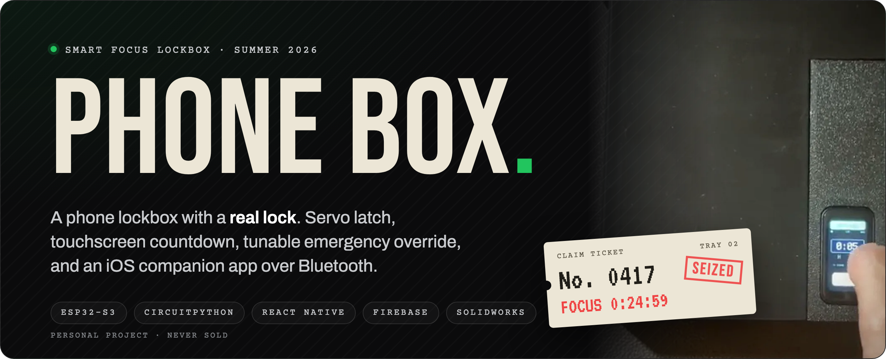
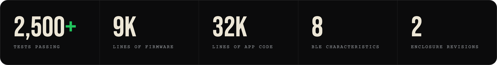
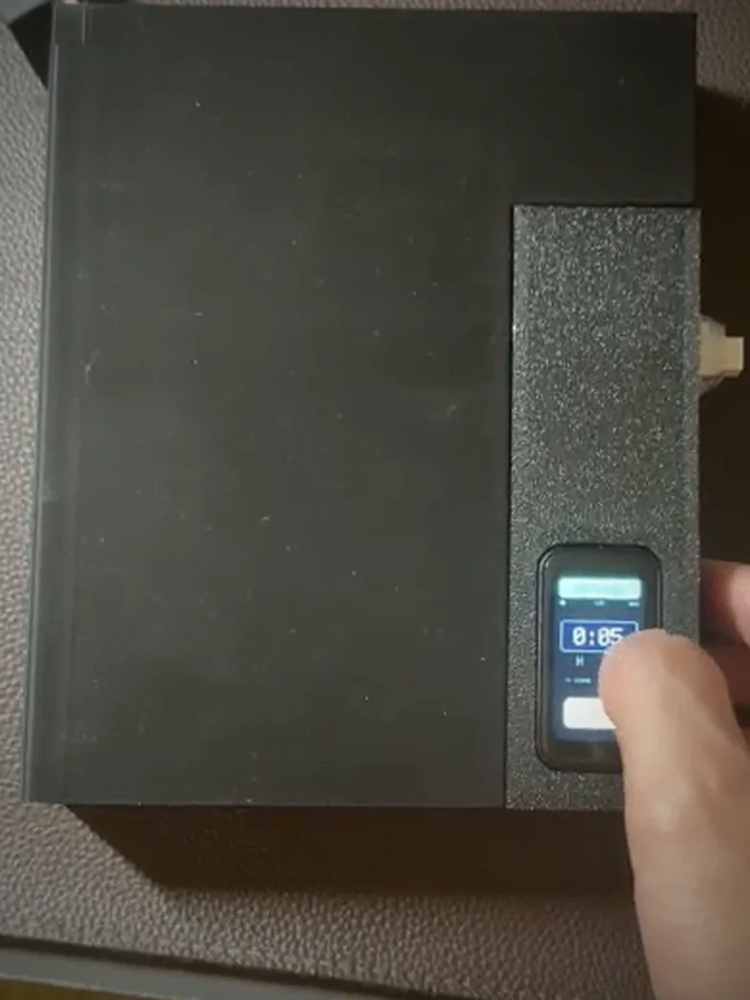
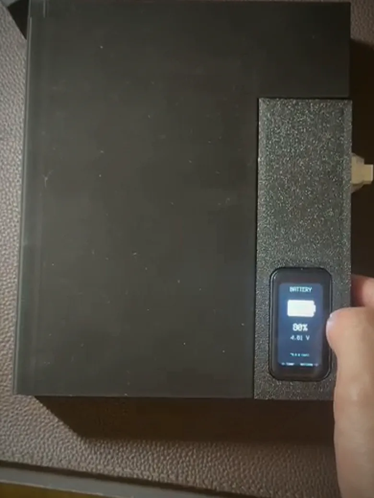
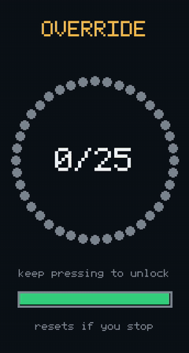
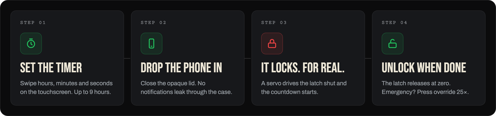
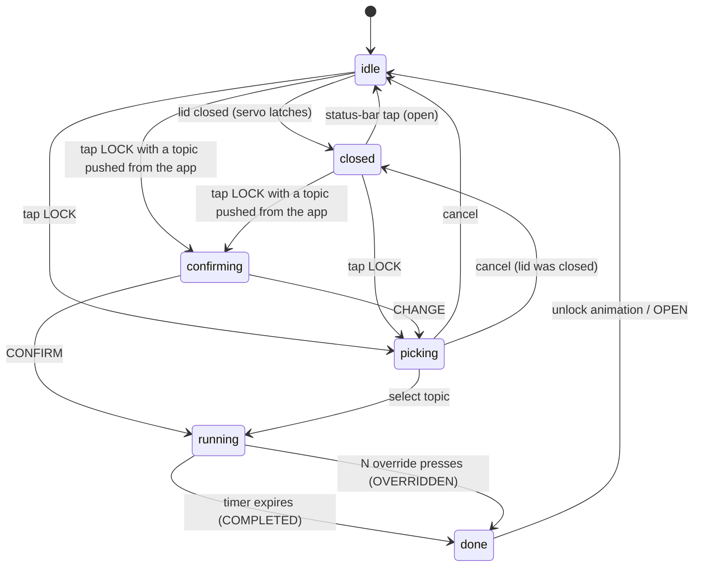
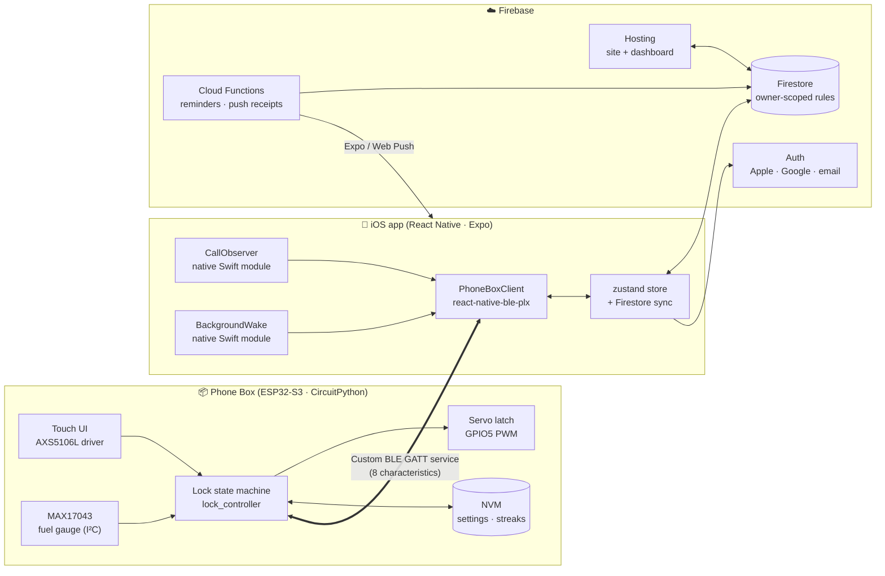
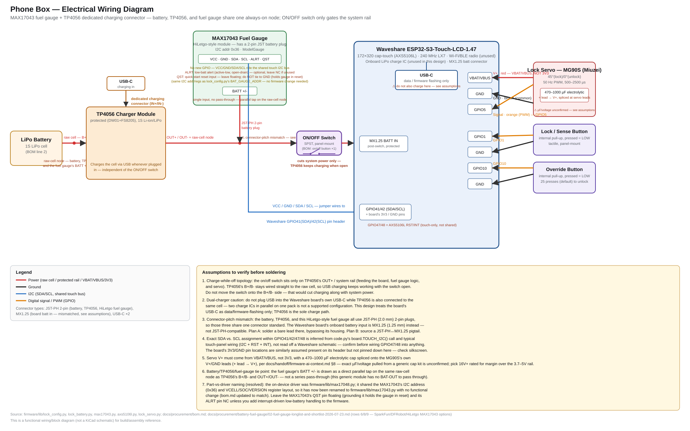

<div align="center">

<a href="https://phonebox-d14b7.web.app"></a>

<br><br>

<a href="https://phonebox-d14b7.web.app"></a>  

        

<br>

**[Why](#why-a-box-not-an-app)** · **[Features](#features)** · **[How it works](#how-it-works)** · **[Architecture](#system-architecture)** · **[Hardware](#hardware)** · **[Engineering](#engineering-problems-we-solved)** · **[Get started](#getting-started)** · **[Testing](#testing)** · **[Built with Claude Code](#built-with-claude-code)**

<br>



<br><br>

<table>
  <tr>
    <td align="center" width="36%"></td>
    <td align="center" width="36%"></td>
    <td align="center" width="28%"></td>
  </tr>
  <tr>
    <td align="center"><sub><b>SET THE TIMER</b><br>Swipe hours, minutes and seconds</sub></td>
    <td align="center"><sub><b>REAL BATTERY GAUGE</b><br>A hand-modified MAX17043 on I²C</sub></td>
    <td align="center"><sub><b>EMERGENCY OVERRIDE</b><br>Press 25&times; to get out early</sub></td>
  </tr>
</table>

</div>

<br>

## Why a box, not an app

> **App blockers are one settings toggle from defeat. A drawer is one weak moment away.**
> The only thing that reliably works is putting the phone somewhere you genuinely can't reach it.

A screen-time toggle can be disabled in two taps. This lock is real, so it can't.

The hard design problem isn't "make a box that closes". It's the **emergency
override**. Make it too rigid and you can't take a call that matters. Make it too
loose and the lock is theater. So the override has **tunable friction**: you
choose how many presses (5 to 500) it takes to get out early. Incoming calls can
also light the screen while the box stays locked.

| | **Phone Box** | kSafe | Generic Amazon box | Brick | Opal | GoAro |
|---|:-:|:-:|:-:|:-:|:-:|:-:|
| Physically locks the phone away | ✅ | ✅ | Partial | ❌ | ❌ | ✅ |
| Touchscreen interface | ✅ | Dial | Dial | App | App | App |
| Tunable emergency override | ✅ | None | Holes | ❌ | Toggle | App |
| Rechargeable & opaque | ✅ | Clear | Varies | n/a | n/a | ✅ |

<sub>To be fair, a commodity box is cheaper and Brick fits in a pocket. Neither has a touchscreen or a tunable override, and building one ourselves was half the point.</sub>

<br>

## Features

<table>
<tr>
<td width="33%" valign="top">

### 📦 On the box
<sub>Fully offline. No account needed.</sub>

**🔒 A real lock.** A servo-driven latch holds the lid shut until the timer ends.

**👆 Touchscreen UI.** A 1.47″ 172×320 display. Swipe to set up to 9 hours, then watch a live countdown.

**🆘 Tunable override.** 5 to 500 presses in steps of 5 (default 25). Every early release is logged.

**🔋 True battery %.** From a hand-modified MAX17043 fuel gauge, not a guess from ADC voltage.

**💾 Survives power cuts.** Settings, schedules and streaks live in on-chip NVM.

**⚡ Brownout recovery.** A `safemode.py` handler and an NVM counter recover automatically if the servo browns out the board mid-lock.

</td>
<td width="33%" valign="top">

### 📱 In the app
<sub>iOS · React Native + Expo</sub>

**📡 Live status over BLE.** Lock state, countdown and battery, streamed from the box.

**📞 Call alert-through.** An incoming call flashes the box's screen while the latch stays shut. Unlock-on-call is a separate setting, off by default.

**📊 Focus stats.** Streaks, totals, a calendar, and custom labels and topics per session.

**🎯 Goals and reminders.** Scheduled sessions with push reminders from Cloud Functions.

**🔐 Sign in anywhere.** Apple, Google or email, with cross-device sync through Firestore.

</td>
<td width="33%" valign="top">

### 🌐 On the web
<sub>Firebase Hosting</sub>

**🪧 Marketing site.** The live site at [phonebox-d14b7.web.app](https://phonebox-d14b7.web.app).

**📈 Signed-in dashboard.** Mirrors the app's stats, goals and planned sessions in the browser.

**🔔 Web Push.** Session reminders reach the browser too.

**♿ Audited.** Includes a UX and accessibility review ([`docs/quality-assurance/`](docs/quality-assurance/)).

</td>
</tr>
</table>

<br>

## How it works



<details>
<summary><b>Under the hood: the firmware state machine</b></summary>
<br>



The state names are the exact values the firmware sends over BLE. The app's
`BoxState` type in `app/src/ble/protocol.ts` mirrors them one-for-one.

</details>

<br>

## System architecture

Three runtimes that never import from each other: **Python on a microcontroller**,
**TypeScript and Swift on a phone**, and **Node in the cloud**. One custom
Bluetooth protocol and one Firestore schema hold them together.



| Layer | Stack | Size |
|---|---|---|
| **Firmware** | CircuitPython 10 on a Waveshare ESP32-S3-Touch-LCD-1.47. Servo lock state machine, custom AXS5106L touch driver, MAX17043 fuel gauge | ~9k lines |
| **App** | React Native 0.86 / Expo 57, TypeScript, `react-native-ble-plx`, zustand, two native Swift modules | ~32k lines |
| **Backend** | Firebase Auth + Firestore, Cloud Functions on Node 20 (scheduled reminders, Expo and Web Push) | ~1k lines |
| **Web** | Static HTML/CSS/ES modules on Firebase Hosting, with a signed-in dashboard | ~7k lines |
| **Enclosure** | SolidWorks, FDM printed | 2 full revisions |

<details>
<summary><b>The BLE GATT protocol: 1 service, 8 characteristics</b></summary>
<br>

One custom service (`6b9a7e00-…-0001`). The UUIDs are defined twice, in
`firmware/lib/lock_config.py` and `app/src/ble/protocol.ts`, and a contract test
(`tests/contracts/bleUuids.test.js`) fails if the two ever drift apart.

| Characteristic | Direction | Purpose |
|---|---|---|
| `status` | box → app · read / notify | State, remaining time, battery, config |
| `history` | box → app · read / notify | RAM queue of sessions finished while no phone was connected |
| `command` | app → box · write | `lock`, `unlock`, `start`, `dur`, `historyAck`… (rate-limited to 1/s) |
| `settings` | round-trip · read / write | Override count, brightness, servo angles, sleep… |
| `timeSync` | app → box · write | Epoch seconds, sets the box clock for session timestamps |
| `alert` | app → box · write | Incoming-call label, which flashes the screen |
| `labels` | app → box · write | Custom session labels as compact JSON |
| `pendingTopic` | app → box · write | A topic suggestion for the next session |

</details>

<br>

## Hardware



> [!TIP]
> The servo runs from the **battery rail with bulk capacitance**, not from 3.3 V. The MAX17043 shares the touchscreen's I²C bus at `0x36`, so it costs **no extra GPIO**.

<table>
<tr>
<td width="55%" valign="top">

**Bill of materials** · ~$44 per prototype

| Part | Spec |
|---|---|
| MCU + display | Waveshare ESP32-S3-Touch-LCD-1.47 |
| Battery | 3.7 V 1S LiPo |
| Lock actuator | Hobby servo, PWM on GPIO5 |
| Fuel gauge | MAX17043 breakout, hand-modified |
| Buttons | Momentary switches (lock + override) |
| Enclosure | 3D-printed main case + lid |

<sub>Full breakdown and cost-down levers in [`docs/procurement/bom.md`](docs/procurement/bom.md).</sub>

</td>
<td width="45%" valign="top">

**Enclosure CAD**

Two full revisions in SolidWorks, drawn for FDM printing. Printed fit-test
coupons (hinge, port, screen bezel, power switch, locking tab) were checked
against the real parts before each full assembly.

📐 [`hardware/cad/`](hardware/cad/): `.sldprt` sources and `.step` exports for the main case and lid.

</td>
</tr>
</table>

<br>

## Engineering problems we solved

<table>
<tr><th width="22%">Problem</th><th width="39%">What was actually wrong</th><th width="39%">Fix</th></tr>
<tr>
<td valign="top"><b>⚙️ The servo kept dying</b><br><sub>Only on real hardware, only sometimes</sub></td>
<td valign="top">Bench-cycling the lock until the pattern appeared showed <b>two faults at once</b>. The CPU clock was scaling out from under the servo's PWM timer, and a motor drawing close to an amp was hanging off a 3.3 V rail that couldn't supply it.</td>
<td valign="top">The firmware re-asserts 50 Hz on every move. The servo now runs from the battery rail with bulk capacitance, and an NVM brownout counter drives automatic recovery.</td>
</tr>
<tr>
<td valign="top"><b>🔋 No battery reading</b><br><sub>The board has no fuel gauge</sub></td>
<td valign="top">A raw ADC voltage is a poor proxy for a LiPo's state of charge, and the voltage divider read consistently off against a multimeter.</td>
<td valign="top">We added a MAX17043 breakout, modified by hand (cut the traces tying its 3 V rail to the battery rail, then soldered and crimped it in), on the existing I²C bus.</td>
</tr>
<tr>
<td valign="top"><b>👆 A touch chip with no driver</b><br><sub>AXS5106L</sub></td>
<td valign="top">No CircuitPython driver existed, and the controller intermittently drops frames mid-touch.</td>
<td valign="top">A custom I²C driver with a debounce fix for the frames the controller drops.</td>
</tr>
<tr>
<td valign="top"><b>🔗 One protocol, two languages</b><br><sub>Python ↔ TypeScript</sub></td>
<td valign="top">The box and the app share a wire contract but never share code, so a UUID or payload change on one side silently breaks the other.</td>
<td valign="top">Both sides are documented against each other, a cross-project contract test guards the UUIDs, and a project skill teaches the AI agent the contract.</td>
</tr>
</table>

<br>

## Repository layout

```
.
├── firmware/            CircuitPython firmware (copied to the CIRCUITPY drive)
│   ├── code.py          Entry point and main loop
│   ├── safemode.py      Brownout auto-recovery
│   └── lib/             lock_* modules, AXS5106L touch + MAX17043 drivers, vendored Adafruit libs
├── app/                 Expo / React Native iOS companion app
│   ├── src/             ble/, screens/, sync/, auth/, stats/, goals/, push/, ui/ …
│   ├── modules/         Native Swift modules: call-observer, background-wake
│   ├── firestore.rules  Security rules (deployed via firebase.json)
│   └── tests/           Firestore rules suites (run against the emulator)
├── functions/           Firebase Cloud Functions: scheduled reminders, push delivery
├── website/             Marketing site + signed-in web dashboard (Firebase Hosting root)
├── hardware/
│   ├── cad/             SolidWorks (.sldprt) and STEP enclosure parts
│   └── wiring-diagram.svg
├── tests/               Host-side firmware tests, website tests, cross-project contract tests
├── scripts/             Demo-account seeding, app-icon generation, doc conversion
├── docs/                RFCs, design reviews, BOM and procurement, handoffs (see docs/README.md)
├── .claude/             Claude Code project skills and subagents
├── fraim/               FRAIM agent-workflow config and project learnings
├── firebase.json        Hosting, Functions and Firestore config
└── AGENTS.md, CLAUDE.md, DESIGN.md, PRODUCT.md   Context files read by AI coding tools
```

<br>

## Getting started

> [!IMPORTANT]
> BLE and the native modules **do not run in Expo Go**. The app needs a development build on a real iPhone (macOS, Xcode and an Apple Developer account). You also need your own Firebase project and the [Firebase CLI](https://firebase.google.com/docs/cli). Host-side tests need Python 3.11+ and Node 20+.

<details open>
<summary><b>📟 Firmware</b></summary>
<br>

1. Flash **CircuitPython 10** onto the Waveshare ESP32-S3-Touch-LCD-1.47.
2. Copy the firmware onto the `CIRCUITPY` drive:
   ```bash
   cp -r firmware/code.py firmware/safemode.py firmware/lib /Volumes/CIRCUITPY/
   ```
3. The board auto-reloads. Pins, colours and every tunable live in `firmware/lib/lock_config.py`.

More in [`firmware/README.md`](firmware/README.md).

</details>

<details>
<summary><b>📱 iOS app</b></summary>
<br>

```bash
cd app
npm ci
cp .env.example .env         # fill in your own Firebase web config
npx expo prebuild --clean    # generates ios/ and links the native modules
npx expo run:ios --device    # build onto a real iPhone
```

More in [`app/README.md`](app/README.md).

</details>

<details>
<summary><b>☁️ Backend and website</b></summary>
<br>

```bash
cd functions && npm ci && npm run build
firebase deploy --only functions,firestore,hosting --project <your-project-id>
```

`website/` is served as-is. Point `website/js/firebaseConfig.js` at your own project.

</details>

<br>

## Testing

| Suite | Command | Size |
|---|---|---|
| 📟 Firmware (host-side) | `python3 tests/run_firmware_tests.py` | 17 files · **672 checks** |
| 🌐 Website + BLE contract | `npm test` | **261 tests** |
| 📱 iOS app | `cd app && npm run test:app` | 112 suites · **1,548 tests** |
| 🔐 Firestore security rules | `npm run test:rules` (starts the emulator) | 6 suites incl. default-deny |
| ☁️ Cloud Functions | `cd functions && npm test` | **37 tests** |

The firmware tests import the **real** firmware modules on a laptop by stubbing
CircuitPython's hardware APIs (`board`, `displayio`, `pwmio`…). `tests/preview/`
renders the box's screens to PNG without the device.

<br>

## Security

- 🛡️ Firestore rules are **owner-scoped**, with per-collection field allow-lists, immutable `createdAt` pins, type and range checks, and a 200-character cap on user-supplied topics.
- ✍️ Session event-log fields are **create-only**: once written, they can't be rewritten.
- 🚫 A **default-deny** catch-all rule has its own test suite.
- 🔒 BLE remote unlock and unlock-on-call both default to **off**, so there's no standing unlock trigger unless the user opts in.
- 🔑 The `EXPO_PUBLIC_*` Firebase values are client config, not credentials. They ship in every app bundle by design, and access control lives in the rules.

<br>

## Built with Claude Code

> [!NOTE]
> Being precise about this matters because it's most of the story: **Claude Code wrote most of the code here.** We specified behaviour, built and tested every revision on real hardware, and debugged what came back wrong, across 240+ commits over one summer.

<table>
<tr><th width="50%">🛠️ By hand</th><th width="50%">🤖 By the agent</th></tr>
<tr>
<td valign="top">

- Industrial and mechanical design: two SolidWorks revisions and every fit-test print
- The MAX17043 hardware modification
- Finding the servo and touch faults on the bench
- Specifying behaviour, testing every build on the device, and driving the agent

</td>
<td valign="top">

- Most of the CircuitPython firmware, including the servo state machine and the AXS5106L driver
- Most of the React Native app and the Firebase backend
- The two native iOS modules (`call-observer`, `background-wake`)
- The wiring diagram, derived from the firmware's own config and drivers

</td>
</tr>
</table>

**How we set up the agent to work safely**

| | |
|---|---|
| 🧠 **Project skills** · [`.claude/skills/`](.claude/skills/) | `ble-protocol` encodes the GATT wire contract, and `native-module-scaffold` encodes the native-module pattern. Without them, an agent changing a UUID on one side would silently break the other. |
| 🔍 **Subagents** · [`.claude/agents/`](.claude/agents/) | `security-reviewer` and `test-writer` run the two review passes we wanted done every time, not just when someone remembered to ask. |
| 📐 **MCP servers** | A parametric-CAD MCP screened battery candidates against the enclosure envelope. "Does this cell fit?" is a geometric question an agent can check fast. We dropped an agent-swarm framework partway through because its subagents never reported results back. |
| 📝 **Paper trail** · [`docs/`](docs/) | RFCs, production-readiness reviews, per-feature evidence and per-session retrospectives. |

<br>

## Documentation

| | |
|---|---|
| 📄 [`docs/rfcs/`](docs/rfcs/) | Technical designs: companion app, Firebase auth and sync, iOS background wake and call notifications |
| ✅ [`docs/production-readiness/`](docs/production-readiness/) | Readiness reviews for the firmware and the app, plus a Firebase hardening runbook |
| 🧾 [`docs/procurement/`](docs/procurement/) | BOM, board cost-reduction study, fuel-gauge sourcing |
| 🚀 [`docs/handoff/`](docs/handoff/) | Firmware context, TestFlight deploy, demo mode |
| 🗂️ [`docs/README.md`](docs/README.md) | Full index |

<br>

## Status

**Working prototype.** The V2 enclosure is assembled, the firmware and app run on
real hardware, and there is an iOS build in TestFlight for our own testing.

<br>

<div align="center">


<sub>Phone Box has never been sold and isn't for sale. No open-source license has been chosen yet, so all rights are reserved by the authors.</sub>

<sub><a href="#readme">↑ Back to top</a></sub>

</div>
